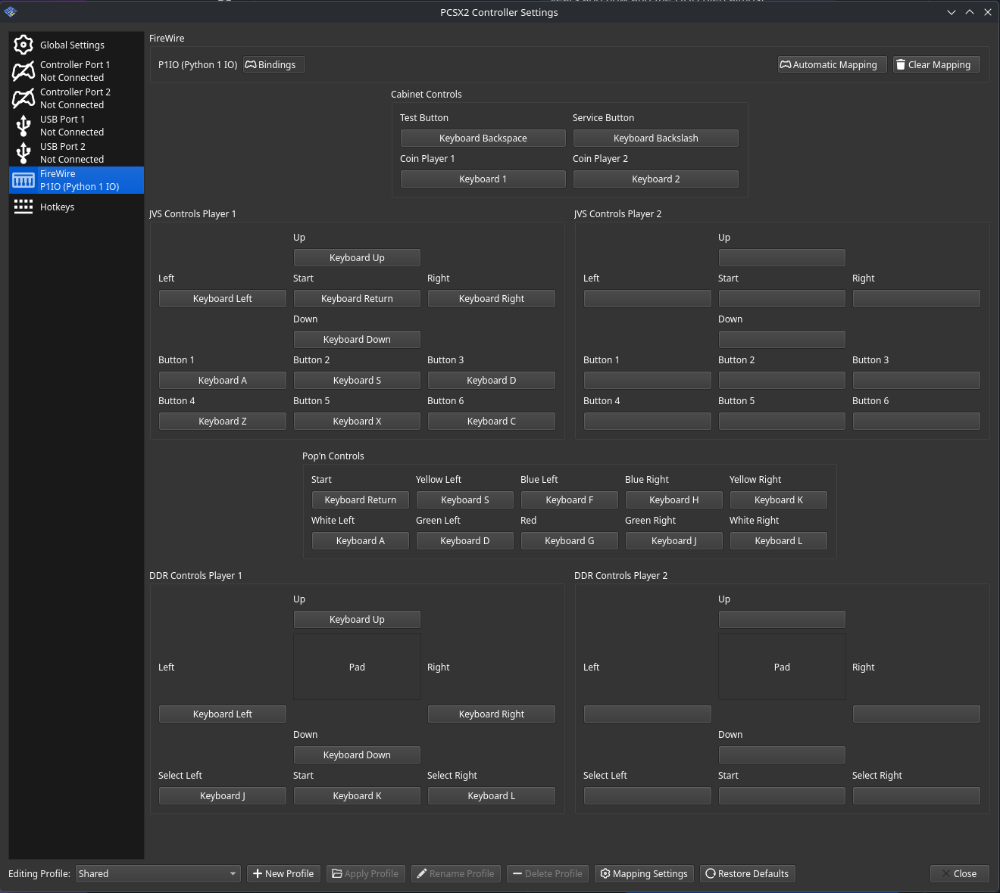

# PCSX2 Reliquary

PCSX2 Reliquary is a PCSX2 fork focused on accurate emulation of security flows and esoteric PS2-derived hardware.

It targets platforms and software outside the usual retail console path, including systems such as the Konami Python 1 & 2, and Namco System families.

## Features

- Full security process support end to end.
- Bring your own keys.
- Support for all Konami Python 2 titles.
- Support for all Konami Pyhton 1 titles.
- Support for CHD-compressed internal HDD images with writable overlays.
- Switch keying mode between Developer, Retail, Arcade, and Prototype on both mechacon and memory cards.
- Support raw PS2 memory card dumps with proper keying.
- Support for utility discs such as HDD installers and DVD installers.
- Boots COH memory card dongles when configured in Arcade mode.
- FireWire Implementation Foundation.

## What This Fork Is For
PCSX2 Reliquary exists for preservation, research, and compatibility work around the parts of the PS2 ecosystem that most emulators never needed to care about.

## Status

Current work is centered on bringing up uncommon PS2-adjacent hardware cleanly while keeping the security and memory card paths accurate and configurable.

This is an experimental fork aimed at preservation, research, and hardware-specific compatibility work.

## Configuration

### Mechacon
Mechacon keystore is configured under the advanced menu tab


### BIOS
You should be running off a **FULL BIOS DUMP**. This means you need not only the bios bin file from the system you wish to boot, but also it's associated NV Ram and Mechacon config sector. This is essential for proper iLinkID matching and security to pass. [biosdrain](https://github.com/F0bes/biosdrain) is a good utility for this.
The associated files should share the name of the base bios dump (.bin/.rom0) and live in the same folder


### Memory Card
Each memory card slot has its own configuration. Each memory card has it's own security processor with it's own keys, particularly the conquest cards for Soul Calibur have different key configuration than the booting dongle.

Here is an example for a Konami Python 1 and Namco System 2x6 config


Memory card IDs are currently hard-coded as `MechaPwn`. This is the same ID that is used in sd2psx so raw memory card images can be used between real hardware and this emulator easily.
PCSX2 memory cards expect the ECC data to be present. Some memorycard dumping utilities dump without hte ECC data, but that can easily be recovered using a tool like [this](https://github.com/ffgriever-pl/PS2-ECC-Memory-Card-Converter).

### Konami Python 2
Python 2 games require pairing of the game hdd image, the associated nvram, the white and black dongle data, as well as other hardware specifics like your e-amuse card id. This can all be configured through a `.py2` file that the game library scanner can read and interpret. Details on this file format are listed in this [wiki article](https://github.com/987123879113/pcsx2/wiki/PY2-Game-Entry-File-Example).

Python 2 HDD images can be provided as either raw `.raw` files or CHD-compressed `.chd` files. CHD images are opened read-only as the base image to reduce collection size, while any writes made by the emulated HDD are stored in a separate writable overlay under `hdd-overlays/` in the emulator settings directory. This keeps the compressed source CHD unchanged and allows per-install or per-user runtime data to persist. To reset a CHD-backed HDD to its base image, close the emulator and delete the matching `.overlay` and `.map` files.

**Ensure the mechacon keys are set properly in the advanced settings menu and that the key mode is set to "Retail"**

Here is an example config for SuperNova 2
```yaml
[Game]
; Friendly name to display in the game list
Name="DDR SuperNova 2"

; Path to HDD image file.
; Note: For Windows you must use \\ instead of just \ for file paths or it WILL NOT WORK.
HddImagePath=gdj_jaa_2007100800.chd

; HDD ID corresponding to the HDD image (required for unpatched drives)
HddIdPath=ps2_hdd_id

; NvRam corresponding to the HDD image (required for unpatched drives)
NvRamPath=ps2_nvram

; Black and white dongle files (required for unpatched games)
; Format of binary dongle file is:
; (Old format)
; 8 bytes - serial ID
; 32 bytes - encrypted dongle payload
;
; OR
;
; (MAME format)
; 32 bytes - encrypted dongle payload
; 8 bytes - serial ID
DongleBlackPath=ds2430_black_gqgdjjaa.bin
DongleWhitePath=ds2430_white_gqfdhjaa.bin

; Input types
; 0 = Drummania
; 1 = Guitar Freaks
; 2 = Dance Dance Revolution
; 3 = Toy's March
; 4 = Thrill Drive 3
; 5 = Dance 86.4 Funky Radio Station
InputType=2

; DIP Switches 1234 (NEW FORMAT)
; Change each individual dipswitch to true or false
DIPSW1=false
DIPSW2=false
DIPSW3=false
DIPSW4=false

; Optional, extended pnach patch file
PatchFile=ddrsn2j.pnach

; Force 31 kHz mode
; Will cause the top of the screen to not refresh in Guitar Freaks, Drummania, Toy's March (all GFDM engine-based games) which also occurs on real hardware.
Force31kHz=0

; Card files are text files with the 16 character card ID.
; Optional. You'll know if you have a need for this.
Player1Card=card1.txt
; Player2Card=card2.txt

; (RECOMMENDED) Manually set a unique ID number to the game as the CRC value.
; If this is not manually set then random number will be generated every time the file is added to the game list, resulting in a new gamesettings .ini to be created for the game each time it's newly imported so settings may not be shared as expected.
; WARNING: If you manually set this value then please make sure that the unique ID does not clash with any other game entries or else there may be bugs with game settings.
UniqueId=334281

; Manually set the region on the game list when imported
; Optional, will default to "NTSC-J".
; See wiki page for list of valid region codes.
; Region=NTSC-J
```

The Python 2 IO board (P2IO) is available as a USB device in the controller configuration screen. It must be plugged into port 1 for the inputs and dongles to be authenticated correctly.


### Konami Python 1
Python 1 games require a COH bios, configured mechacon keys, configured arcade override keys and accurate IO Board dumps.

This is all configured through a .py1 file that the game library scanner can read and interpret. HDD and CF images can be loaded directly as either `.raw` or `.chd` files. Any changes to `.chd` files will be written to the PCSX2 settings directory under `hdd-overlays`. To reset a CHD-backed HDD to its base image, close the emulator and delete the matching .overlay and .map files.

Here is an example config for Pop'n Music 14
```yaml
[Game]
; Name of the game that appears in the game list
Name=Pop'n Music 14
; Path to the hdd image to load for the title
HddImagePath=popn14/popn14.chd
; Path to the CF image to load for the title
; Games use either a CF or HDD image, but update kits can use CF cards to perform the updates
; CF Cards also have a MBR + FAT16 container around the pythonFS, this is handled automatically
; CfImagePath=
; Battery backed sram dump. Most games happily initialize an empty sram, some need it for security.
BbsRamPath=popn14/m48t58y.u48
; IO Board Boot Rom dump, this is the boot rom for the Python 1 IO board.
; It contains data important to pass security checks in-game.
IoBootRomPath=popn14/b22a01.u42
; IO Board Firmware Config dump. Game expects the IO Board to report a specific OUI from the firewire controller
IoConfigRomPath=popn14/d72872gc.crom
; IO Board has a built in ds2430 that contains serial information used in game security
InternalDonglePath=popn14/ds2430.u3
; IO Board can also optionally have a round black dongle inserted, most games use this as a backup if internal doesn't match.
; Some titles require a dongle only
ExternalDonglePath=popn14/ds2430_black_gnf14jab.u3
; Memory card dongle dump with ECC data. Most games use the same memory card, but there is an exception for satellite terminals
MemoryCardDonglePath=popn14/kn00002.ps2
; Memory card card-id. Important for pairing data on KELFs, not required for boot
MemoryCardIdPath=popn14/kn00002.id
; IO Mode configuration. Options are 'PPOOL', 'JVS', 'EXTIO', and 'POPN'
IoMode=POPN
; GameConfig loader tries to extract this from the IO Boot rom dump, but this can be inaccurate
; depending on the quality of the dump or in certain situations like upgrade kits.
; This option lets you manually override the value
GameId=GNF14JAB
```

Python 1 controls can be configured under the FireWire menu within the controller configuration screen:


Perfect pool will automatically set USB device 1 to Trackball and USB device 2 to Perfect Pool Camera. These can be configured in this menu as well, but Camera setup is very minimal and game isn't really playable.
### Retail/Utility Disks
If your bios is a proper dump, and your mechacon and memory cards are setup in Retail mode, then any HDD based functionality will work like a real console. This lets you do things like run the HDD Utility disks, boot FMCB, install game HDD functionality or boot DVD update payloads.

